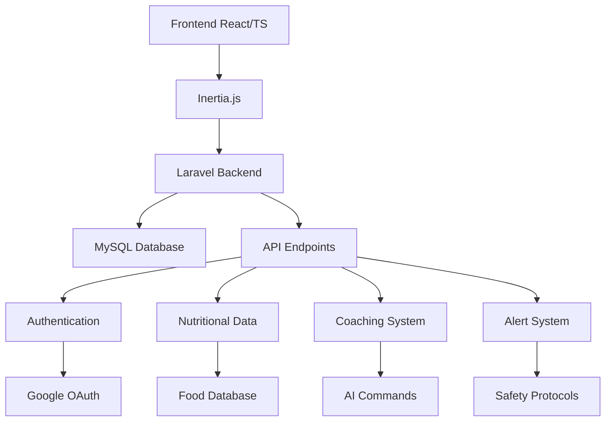

# 🥗 NutriCoach - Sistema de IA para Transformación Corporal

<div align="center">


**Un agente de inteligencia artificial especializado en seguimiento nutricional y análisis calórico personalizado**

[](https://laravel.com)
[](https://reactjs.org)
[](https://www.typescriptlang.org)
[](https://inertiajs.com)
[](https://tailwindcss.com)

[](LICENSE)
[](https://php.net)
[](https://nodejs.org)

</div>

---

## 🎯 **Descripción del Proyecto**

NutriCoach es un sistema de inteligencia artificial diseñado para acompañar a usuarios en procesos de transformación corporal, combinando precisión nutricional con inteligencia emocional para ofrecer un coaching integral que va más allá del simple conteo de calorías.

### 🌟 **Características Principales**

- 🧠 **Inteligencia Emocional Integrada** - Reconocimiento de patrones emocionales y apoyo psicológico
- 🎯 **Análisis Calórico Inteligente** - Desglose detallado de macronutrientes y evaluación de adherencia
- 🛡️ **Protocolos de Seguridad** - Alertas automáticas y disclaimer médico obligatorio
- 📊 **Seguimiento Diario Flexible** - Registro completo con tolerancia contextual adaptativa
- 🍎 **Base de Datos Nutricional Completa** - 12+ alimentos con valores precisos por 100g
- 💧 **Sistema de Hidratación** - Seguimiento de consumo diario con metas personalizadas
- 🎨 **UI/UX Moderna** - Diseño 2025 con animaciones GSAP y scroll-driven video

---

## 🚀 **Tecnologías Utilizadas**

### **Backend**
- **Laravel 11.x** - Framework PHP robusto
- **Laravel Sanctum** - Autenticación API
- **Laravel Socialite** - OAuth con Google
- **MySQL/SQLite** - Base de datos
- **Pest** - Testing framework

### **Frontend**
- **React 18.x** - Biblioteca de UI
- **TypeScript 5.x** - Tipado estático
- **Inertia.js** - SPA sin API
- **Tailwind CSS 3.x** - Framework CSS
- **GSAP** - Animaciones avanzadas
- **Vite** - Build tool moderno

### **Herramientas de Desarrollo**
- **Composer** - Gestión de dependencias PHP
- **NPM** - Gestión de paquetes Node.js
- **Git** - Control de versiones

---

## 📋 **Funcionalidades Implementadas**

### 🧠 **Sistema de Inteligencia Emocional**

| Funcionalidad | Descripción | Estado |
|---------------|-------------|--------|
| **Factores Contextuales** | Ajuste de tolerancia por días estresantes, fines de semana, enfermedades | ✅ |
| **Recomendaciones Adaptativas** | Tips personalizados según contexto emocional | ✅ |
| **Escalas de Estado** | Medición de estrés, energía y estado de ánimo (1-10) | ✅ |
| **Coaching Sin Culpa** | Feedback constructivo que promueve autocompasión | ✅ |

### 🛡️ **Protocolos de Seguridad**

| Funcionalidad | Descripción | Estado |
|---------------|-------------|--------|
| **Alertas Automáticas** | Detección de pérdida de peso acelerada y comportamientos obsesivos | ✅ |
| **Disclaimer Médico** | Aceptación obligatoria de términos médicos | ✅ |
| **Recomendaciones Médicas** | Sugerencias de consulta profesional | ✅ |
| **Prevención de Obsesiones** | Alertas por registro excesivo de comidas | ✅ |

### 📊 **Seguimiento Nutricional**

| Funcionalidad | Descripción | Estado |
|---------------|-------------|--------|
| **Análisis Calórico** | Cálculo preciso de calorías y macronutrientes | ✅ |
| **Evaluación Adaptativa** | Sistema de colores (Verde/Amarillo/Rojo) con tolerancia contextual | ✅ |
| **Resúmenes Diarios** | Análisis completo con insights personalizados | ✅ |
| **Seguimiento Semanal** | Progreso y tendencias a largo plazo | ✅ |

### 🍎 **Base de Datos Nutricional**

| Categoría | Alimentos Incluidos | Valores |
|-----------|-------------------|---------|
| **Proteínas** | Pollo, Huevos, Salmón | Por 100g cocido |
| **Carbohidratos** | Papa, Batata, Arroz | Calorías + Macros |
| **Grasas** | Aguacate, Aceite de Oliva | Precisión nutricional |
| **Verduras** | Espinacas, Brócoli | Valores completos |
| **Suplementos** | Whey Protein, Creatina | Datos específicos |

### 🎯 **Comandos Especiales de Coaching**

| Comando | Función | Descripción |
|---------|---------|-------------|
| `"Resumen del día"` | Análisis completo | Insights detallados con evaluación |
| `"¿Cómo voy?"` | Estado de progreso | Comparación con objetivos |
| `"Día difícil"` | Modo comprensivo | Estrategias para momentos difíciles |
| `"SOS antojo"` | Manejo de antojos | Técnicas inmediatas |
| `"Situación social"` | Tips sociales | Consejos para eventos y restaurantes |

---

## 🏗️ **Arquitectura del Sistema**



---

## 📦 **Instalación y Configuración**

### **Prerrequisitos**
- PHP 8.2+
- Node.js 18+
- Composer
- MySQL/SQLite

### **1. Clonar el Repositorio**
```bash
git clone https://github.com/tu-usuario/nuticoachback.git
cd nuticoachback
```

### **2. Instalar Dependencias**
```bash
# Backend
composer install

# Frontend
npm install
```

### **3. Configurar Variables de Entorno**
```bash
cp .env.example .env
php artisan key:generate
```

Configurar en `.env`:
```env
# Base de datos
DB_CONNECTION=sqlite
DB_DATABASE=database/database.sqlite

# Google OAuth
GOOGLE_CLIENT_ID=tu_client_id
GOOGLE_CLIENT_SECRET=tu_client_secret
GOOGLE_REDIRECT_URI=http://localhost:8000/auth/google/callback
```

### **4. Configurar Base de Datos**
```bash
# Crear archivo SQLite
touch database/database.sqlite

# Ejecutar migraciones
php artisan migrate

# Poblar con datos de ejemplo
php artisan db:seed
```

### **5. Compilar Assets**
```bash
npm run dev
# o para producción
npm run build
```

### **6. Iniciar Servidor**
```bash
php artisan serve
```

---

## 🔌 **API Endpoints**

### **Autenticación**
```http
POST /auth/google/redirect    # Iniciar OAuth Google
GET  /auth/google/callback    # Callback OAuth
```

### **Perfil de Usuario**
```http
GET  /api/profile             # Obtener perfil
POST /api/profile             # Crear perfil
PUT  /api/profile             # Actualizar perfil
```

### **Datos Nutricionales**
```http
GET  /api/nutrition           # Listar registros
POST /api/nutrition           # Crear registro
GET  /api/nutrition/daily-summary     # Resumen diario
GET  /api/nutrition/weekly-summary    # Resumen semanal
```

### **Coaching Inteligente**
```http
POST /api/coaching/daily-summary      # Generar resumen del día
POST /api/coaching/progress-check     # Verificar progreso
POST /api/coaching/difficult-day      # Estrategias para día difícil
POST /api/coaching/craving-sos        # SOS antojos
POST /api/coaching/social-situation   # Tips sociales
```

### **Alertas y Seguridad**
```http
GET  /api/alerts                      # Alertas activas
POST /api/alerts/check                # Verificar y generar alertas
GET  /api/alerts/medical-disclaimer   # Obtener disclaimer
POST /api/alerts/medical-disclaimer/accept  # Aceptar disclaimer
```

### **Contexto Adaptativo**
```http
GET  /api/context/tolerance           # Tolerancia ajustada
GET  /api/context/adherence           # Evaluación con contexto
GET  /api/context/recommendations     # Recomendaciones contextuales
```

---

## 🎨 **Características de UI/UX**

### **Diseño Moderno 2025**
- 🎨 **Paleta de Colores**: BG E0FE10/1C2227, Text FFFFFF/434B53
- ✨ **Animaciones GSAP**: Transiciones suaves y profesionales
- 📱 **Responsive Design**: Adaptable a todos los dispositivos
- 🎬 **Scroll-Driven Video**: Video que avanza con el scroll

### **Componentes Principales**
- **Header Translúcido** - Logo, login y descarga APK
- **Hero Section** - Video interactivo con scroll
- **Features Section** - Características principales animadas
- **Benefits Section** - Ventajas del sistema

---

## 🧪 **Testing**

```bash
# Ejecutar tests PHP
php artisan test

# Ejecutar tests específicos
php artisan test --filter=NutritionalDataTest
```

---

## 📊 **Estructura de Base de Datos**

### **Tablas Principales**
- `users` - Usuarios del sistema
- `user_profiles` - Perfiles nutricionales
- `food_items` - Base de datos nutricional
- `nutritional_data` - Registros de consumo
- `user_contexts` - Factores contextuales
- `meal_plans` - Planificación de comidas
- `hydration_records` - Registros de hidratación
- `coaching_messages` - Mensajes de coaching
- `user_alerts` - Alertas del sistema
- `medical_disclaimers` - Disclaimers médicos

---

## 🤝 **Contribución**

1. Fork el proyecto
2. Crea una rama para tu feature (`git checkout -b feature/AmazingFeature`)
3. Commit tus cambios (`git commit -m 'Add some AmazingFeature'`)
4. Push a la rama (`git push origin feature/AmazingFeature`)
5. Abre un Pull Request

---

## 📝 **Licencia**

Este proyecto está bajo la Licencia MIT. Ver el archivo [LICENSE](LICENSE) para más detalles.

---

## 👥 **Equipo de Desarrollo**

- **Desarrollador Principal** - Implementación completa del sistema
- **Diseño UI/UX** - Interfaz moderna y responsive
- **Arquitectura** - Sistema escalable y mantenible

---

## 📞 **Contacto**

- **Proyecto**: [NutriCoach GitHub](https://github.com/tu-usuario/nuticoachback)
- **Issues**: [Reportar Bug](https://github.com/tu-usuario/nuticoachback/issues)
- **Discusiones**: [GitHub Discussions](https://github.com/tu-usuario/nuticoachback/discussions)

---

<div align="center">

**⭐ Si te gusta este proyecto, ¡dale una estrella! ⭐**


</div>